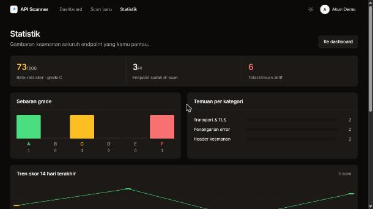
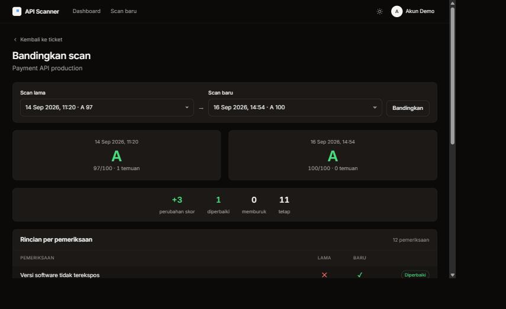
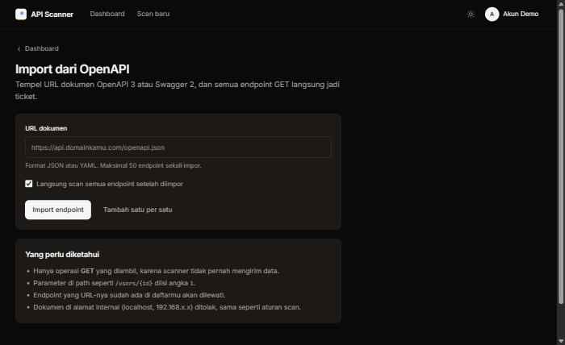
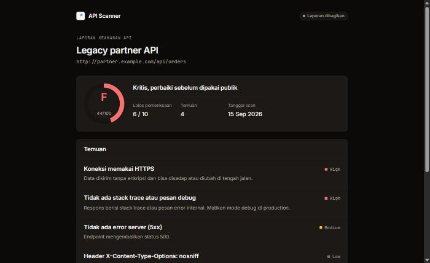

<div align="center">

# API Scanner

### Temukan celah di API kamu sebelum orang lain menemukannya.

Tempel URL endpoint, jalankan scan, dan dapatkan **skor keamanan 0–100** beserta daftar masalah yang diurutkan dari yang paling berisiko — lengkap dengan cara memperbaikinya.

[](https://github.com/ZainulArkaanAlinsi/api-security-scanner/actions/workflows/tests.yml)
[](https://github.com/ZainulArkaanAlinsi/api-security-scanner/actions/workflows/docker.yml)
[](LICENSE)


[](https://codespaces.new/ZainulArkaanAlinsi/api-security-scanner)

**Coba langsung di browser** — klik tombol di atas, tunggu dua menit, aplikasinya jalan lengkap dengan data contoh dan queue worker. Tanpa instalasi apa pun di komputermu.


</div>

---

## Masalahnya

Kebanyakan kebocoran API bukan karena serangan canggih. Penyebabnya hal-hal kecil yang terlewat saat deploy: file `.env` yang ikut ter-upload, mode debug yang masih menyala, CORS yang dibuka untuk semua origin saat debugging lalu lupa ditutup, atau sertifikat yang habis diam-diam di hari Sabtu.

Semua itu bisa dicek dalam hitungan detik — asal ada yang rutin mengeceknya.

## Solusinya

Daftarkan endpoint sekali, lalu biarkan aplikasi ini yang mengecek. Bukan cuma membaca header: scanner **benar-benar menguji** endpoint-nya, lalu memberi skor yang bisa kamu pantau naik-turunnya dari waktu ke waktu.

<table>
<tr>
<td width="50%" valign="top">

**Skor yang langsung dimengerti**

Lingkaran skor dan grade A–F, plus rincian temuan per tingkat risiko dan saran perbaikan yang konkret.


</td>
<td width="50%" valign="top">

**Masuk tanpa basa-basi**

Halaman login dengan contoh hasil scan di sisinya, supaya pengunjung langsung tahu ini aplikasi apa.


</td>
</tr>
</table>

### Mode terang & gelap

Tema mengikuti setelan sistem, dan bisa diganti kapan saja lewat satu tombol di navbar.

<table>
<tr>
<td width="50%" valign="top" align="center">

**Terang**


</td>
<td width="50%" valign="top" align="center">

**Gelap**


</td>
</tr>
</table>

---

## Apa yang dicek

**18+ pemeriksaan** dalam satu scan, terbagi tujuh kategori. Yang bertanda 🔎 dilakukan dengan **mengirim request tambahan**, bukan sekadar membaca respons pertama.

| Kategori | Pemeriksaan | Risiko tertinggi |
|---|---|:---:|
| **Berkas terekspos** 🔎 | `.env`, `.git/config`, `phpinfo.php`, `/actuator/env`, `/server-status`, `.DS_Store` — dicocokkan dengan tanda isi file, bukan sekadar status 200 | 🔴 critical |
| **Data sensitif** | JWT, AWS key, private key, password di JSON, email, nomor kartu, NIK — dilaporkan **jenisnya saja**, nilainya tidak pernah ikut | 🔴 critical |
| **Penanganan error** 🔎 | Kirim parameter janggal lalu cari pesan error database (indikasi SQL injection), stack trace, dan status 5xx | 🔴 high |
| **Transport** | HTTPS, masa berlaku sertifikat TLS, HSTS | 🔴 high |
| **Autentikasi** | Endpoint yang membalas data JSON tanpa token sama sekali | 🟠 medium |
| **Konfigurasi** 🔎 | Rate limit (burst 6 request), method berisiko seperti TRACE/PUT/DELETE | 🟠 medium |
| **Header & cookie** | CORS wildcard, `HttpOnly`/`Secure`, `nosniff`, clickjacking, CSP, kebocoran versi software | 🔴 high |

### Skor & grade

Setiap temuan mengurangi skor: **critical −45, high −22, medium −9, low −3**. Bobotnya sengaja curam, supaya satu file `.env` yang terekspos langsung menjatuhkan nilai.

| Skor | 90+ | 80–89 | 70–79 | 60–69 | 45–59 | &lt;45 |
|---|:---:|:---:|:---:|:---:|:---:|:---:|
| **Grade** | A | B | C | D | E | F |

Skor disimpan di setiap scan, jadi grafik tren di halaman ticket memperlihatkan apakah keamanan API-mu membaik atau memburuk.

### Statistik seluruh endpoint

Halaman **Statistik** merangkum semuanya dalam satu layar: rata-rata skor, sebaran grade A–F, temuan per kategori, tren skor 14 hari terakhir, masalah yang paling sering muncul, dan endpoint paling rawan.



### Bandingkan dua scan

Pilih dua tanggal, lihat persis apa yang berubah: perubahan skor, pemeriksaan yang **diperbaiki**, yang **memburuk**, dan yang tetap sama. Baris yang berubah ditaruh paling atas, lengkap dengan alasan kegagalannya.



---

## Fitur

| | |
|---|---|
| 🔎 **Scanner aktif** | 18+ pemeriksaan, hasil diurutkan dari risiko tertinggi, tiap temuan disertai cara memperbaikinya |
| 💯 **Skor & grade** | Nilai 0–100 dengan grade A–F, rata-rata seluruh endpoint di dashboard |
| 📥 **Import OpenAPI** | Tempel satu URL spec, semua endpoint GET jadi ticket dan bisa langsung di-scan |
| ⚡ **Antrean** | Scan dikerjakan worker di latar belakang, request web tidak pernah menunggu |
| 📈 **Riwayat & perbandingan** | Grafik tren skor, dan perbandingan dua scan berdampingan per pemeriksaan |
| 🔔 **Monitoring otomatis** | Scan ulang tiap 6 jam, peringatan hanya untuk temuan high/critical yang benar-benar baru |
| 💬 **Slack & Discord** | Peringatan yang sama dikirim ke channel tim, bukan cuma email |
| 📊 **Statistik** | Sebaran grade, temuan per kategori, tren skor, dan endpoint paling rawan |
| 🔗 **Link laporan publik** | Bagikan hasil scan lewat URL rahasia, tanpa perlu akun. Bisa dimatikan kapan saja |
| 🏷️ **Badge skor** | SVG bergaya shields.io berisi grade API-mu, siap ditempel di README proyek |
| 🚀 **Scan massal** | Satu tombol untuk mengantrekan scan seluruh endpoint sekaligus |
| 🤖 **API untuk CI/CD** | Token Bearer, scan dipanggil dari GitHub Actions atau pipeline mana pun |
| 📄 **Laporan** | Versi cetak / simpan PDF, unduhan JSON, dan export CSV daftar ticket |
| 🛡️ **Aman by default** | Anti-SSRF, isolasi data antar pengguna, rate limit, header keamanan di aplikasinya sendiri |

### Aman sejak di dalam

Aplikasi yang menilai keamanan orang lain harus tahan uji sendiri:

- **Anti-SSRF berlapis** — localhost, IP privat, dan alamat metadata cloud ditolak; koneksi dikunci ke IP yang sudah divalidasi supaya DNS tidak bisa ditukar di tengah jalan; redirect tidak diikuti. Aturan yang sama berlaku untuk URL dokumen OpenAPI
- **Tidak bisa disalahgunakan** — scan dibatasi ke port 80/443 dan respons dipotong di 5 MB
- **Data terisolasi** — ticket milik pengguna lain dijawab 404, bukan 403, supaya ID tidak bisa ditebak
- **Token aman** — API token disimpan sebagai hash SHA-256 dan hanya ditampilkan sekali
- **Tahan gagal** — scan yang mati di tengah jalan tidak meninggalkan ticket menggantung, dan satu ticket tidak bisa di-scan dua kali bersamaan
- **Header sendiri lulus** — `X-Frame-Options`, CSP, `nosniff`, `Referrer-Policy`, dan HSTS dipasang otomatis

---

## Mulai dalam 5 menit

```bash
git clone https://github.com/ZainulArkaanAlinsi/api-security-scanner.git
cd api-security-scanner

composer install
npm install && npm run build

cp .env.example .env
php artisan key:generate
php artisan migrate
php artisan db:seed --class=DemoSeeder   # opsional: data contoh
```

Jalankan **dua proses** ini:

```bash
php artisan serve        # aplikasi web
php artisan queue:work   # pengeksekusi scan  <- wajib, tanpa ini scan tidak pernah selesai
```

Buka http://127.0.0.1:8000, lalu masuk dengan akun demo:

| Email | Password |
|---|---|
| `demo@example.com` | `demo12345` |

> Setiap kali kode berubah, **restart queue worker** — worker memuat kode sekali saat dijalankan.

### Import dari OpenAPI

Menu **Import OpenAPI** menerima URL dokumen OpenAPI 3 atau Swagger 2, format JSON maupun YAML:

```
https://petstore3.swagger.io/api/v3/openapi.json
```

Semua operasi `GET` jadi ticket (maksimal 50 sekali impor), parameter seperti `/pet/{petId}` diisi `1`, endpoint yang sudah ada dilewati, dan bisa langsung di-scan semuanya.



### Monitoring otomatis

Aktifkan lewat tombol di halaman ticket, lalu jalankan penjadwal:

```bash
php artisan schedule:work                # lokal
# di server: * * * * * cd /path && php artisan schedule:run >> /dev/null 2>&1
```

`scan:due --hours=2` berjalan tiap 6 jam. Peringatan hanya dikirim untuk temuan **high/critical yang belum ada di scan sebelumnya**, jadi tidak ada spam untuk masalah yang sama.

Selain email, hasilnya bisa dikirim ke **Slack atau Discord**: tempel URL incoming webhook di halaman Profil, dan pesan tes langsung dikirim untuk memastikan sambungannya benar. Hanya domain resmi kedua layanan yang diterima — kolom URL bebas akan membuka celah SSRF baru.

---

## API untuk CI/CD

Buat token di halaman **Profil → API token** (ditampilkan sekali, disimpan sebagai hash), lalu:

```bash
# Antrekan scan
curl -X POST https://host-kamu/api/v1/scans \
  -H "Authorization: Bearer $API_SCANNER_TOKEN" \
  -H "Content-Type: application/json" \
  -d '{"url":"https://api.domainkamu.com/v1/health"}'

# Ambil hasilnya
curl https://host-kamu/api/v1/scans/12 \
  -H "Authorization: Bearer $API_SCANNER_TOKEN"
```

| Endpoint | Keterangan |
|---|---|
| `POST /api/v1/scans` | Antrekan scan (202). URL yang sudah terdaftar dipakai ulang, bukan diduplikasi |
| `GET /api/v1/scans/{id}` | Skor, grade, temuan, dan detail hasil |
| `GET /api/v1/tickets` | Daftar endpoint beserta skor terakhir |

Contoh di GitHub Actions — gagalkan build kalau skornya jeblok:

```yaml
- name: Scan API
  run: |
    ID=$(curl -sX POST $SCANNER/api/v1/scans \
      -H "Authorization: Bearer ${{ secrets.API_SCANNER_TOKEN }}" \
      -H "Content-Type: application/json" \
      -d '{"url":"https://api.domainkamu.com/v1/health"}' | jq .data.id)
    sleep 20
    SCORE=$(curl -s $SCANNER/api/v1/scans/$ID \
      -H "Authorization: Bearer ${{ secrets.API_SCANNER_TOKEN }}" | jq .data.score)
    echo "Skor keamanan: $SCORE"
    [ "$SCORE" -ge 80 ] || { echo "Skor di bawah 80"; exit 1; }
```

## Berbagi laporan

Tombol **Buat link publik** di halaman ticket menghasilkan URL rahasia (`/r/{token}`) yang bisa dibuka tanpa login — enak untuk dikirim ke klien atau tim. Mematikan lalu menyalakannya lagi menerbitkan link baru, sehingga link lama langsung mati.



Halamannya read-only, punya `noindex` supaya tidak terindeks mesin pencari, dan hanya memuat hasil scan — tidak ada tombol aksi, tidak ada data akun.

### Badge untuk README

Setiap laporan yang dibagikan otomatis punya badge SVG, siap ditempel di README proyekmu sendiri:

```markdown
[](https://host-kamu/r/{token})
```

Warnanya mengikuti skor — hijau untuk A, merah untuk F — dan ikut berubah setiap kali endpoint di-scan ulang. Mematikan link publik juga mematikan badge-nya.

---

## Konfigurasi

| Variabel `.env` | Default | Keterangan |
|---|---|---|
| `SCANNER_CA_BUNDLE` | kosong | Path file CA untuk verifikasi HTTPS. **Wajib di Laragon/Windows** jika `curl.cainfo` kosong, misalnya `C:/laragon/etc/ssl/cacert.pem` |
| `SCANNER_ACTIVE_PROBES` | `true` | Matikan untuk scan header saja, tanpa request tambahan |
| `SCANNER_ALLOW_PRIVATE` | `false` | Izinkan scan ke IP privat. Aktifkan hanya di mesin lokal |
| `SCANNER_TIMEOUT` | `10` | Batas waktu respons target (detik) |
| `SCANNER_PROBE_TIMEOUT` | `5` | Batas waktu tiap probe |
| `SCANNER_IMPORT_LIMIT` | `50` | Maksimal endpoint per impor OpenAPI |
| `QUEUE_CONNECTION` | `database` | Scan dijalankan lewat antrean |
| `MAIL_MAILER` | `log` | Dengan `log`, email ditulis ke `storage/logs/laravel.log` |

<details>
<summary><b>Checklist sebelum deploy ke production</b></summary>

<br>

- [ ] `APP_ENV=production` dan `APP_DEBUG=false` — mode debug membocorkan stack trace dan isi env
- [ ] `APP_KEY` dibuat ulang dengan `php artisan key:generate`
- [ ] `APP_URL` diisi domain sebenarnya (dipakai link email dan link laporan publik)
- [ ] `SESSION_SECURE_COOKIE=true` saat memakai HTTPS
- [ ] `SCANNER_ALLOW_PRIVATE=false`
- [ ] Konfigurasi SMTP diisi, jangan biarkan `MAIL_MAILER=log`
- [ ] Queue worker dijalankan sebagai service (Supervisor/systemd) dan ikut di-restart setiap deploy
- [ ] `DemoSeeder` tidak dijalankan

</details>

## Deploy

Sudah tersedia `Dockerfile`, `fly.toml`, dan `docker-compose.yml`. Satu image dipakai tiga proses: web, queue worker, dan scheduler.

```bash
docker compose up --build     # jalankan versi production di komputer sendiri
```

Panduan lengkap:

- **[docs/DEPLOY-ORACLE.md](docs/DEPLOY-ORACLE.md)** — VM Oracle Cloud Always Free (gratis selamanya), satu skrip sampai jalan
- **[docs/DEPLOY.md](docs/DEPLOY.md)** — Railway dan Fly.io, termasuk daftar variabel dan checklist setelah deploy

> Platform yang hanya menjalankan satu proses web (Vercel, Netlify, shared hosting) tidak cocok, karena scan dikerjakan oleh worker terpisah.

---

## Teknologi

**Laravel 12** · **PHP 8.2+** · MySQL/MariaDB atau SQLite · antrean berbasis database · Blade dengan design system sendiri (tanpa framework CSS) · PHPUnit · GitHub Actions · Docker + FrankenPHP

### Peta kode

| Lokasi | Isi |
|---|---|
| `app/Services/ApiScanner.php` | Semua pemeriksaan pasif dan probe aktif |
| `app/Services/TargetResolver.php` | Penjaga SSRF yang dipakai bersama scanner dan importer |
| `app/Services/SecurityScore.php` | Perhitungan skor dan grade |
| `app/Services/OpenApiImporter.php` | Membaca OpenAPI 3 / Swagger 2, JSON maupun YAML |
| `app/Services/ScanRunner.php` | Menjalankan scan, menyimpan riwayat, memicu notifikasi |
| `app/Jobs/ScanTicketJob.php` | Scan versi antrean, lengkap dengan penanganan worker mati |
| `app/Http/Controllers/Api/ScanApiController.php` | API untuk CI/CD |
| `app/Policies/TicketPolicy.php` | Aturan kepemilikan ticket |
| `resources/views/partials/theme.blade.php` | Design token dan komponen UI bersama |

## Testing

```bash
php artisan test        # 129 test
./vendor/bin/pint       # code style
```

Test memakai SQLite in-memory, jadi database utama tidak tersentuh. Request HTTP dan pemeriksaan sertifikat di-mock, sehingga test jalan tanpa koneksi internet. Setiap push diperiksa GitHub Actions, termasuk build image Docker.

## Rencana berikutnya

- [ ] Verifikasi email saat registrasi
- [ ] Webhook ke Slack/Discord selain email
- [ ] Perbandingan berdampingan antar dua scan pilihan
- [ ] Pemeriksaan autentikasi yang lebih dalam (uji token kedaluwarsa dan akses lintas akun)

---

## Catatan penggunaan

Scanner mengirim beberapa request `GET` ke URL yang kamu daftarkan dan ke beberapa path umum seperti `/.env` — tidak ada eksploitasi, tidak ada perubahan data, tidak ada brute force. Meski begitu, **scan hanya endpoint yang kamu miliki atau yang kamu punya izin untuk menguji.**

## Lisensi

[MIT](LICENSE) © Zainul Arkaan Alinsi
