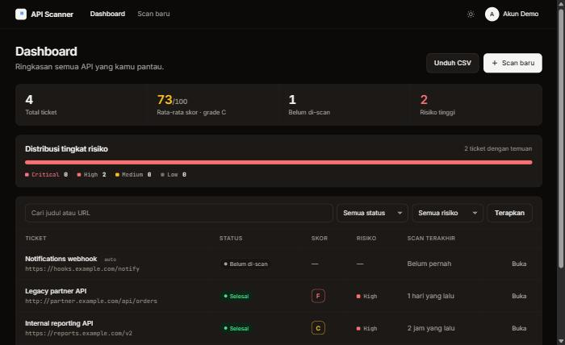
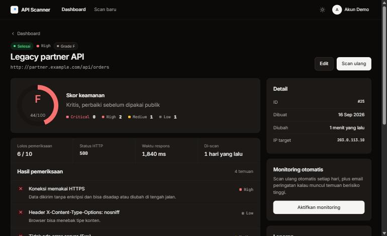
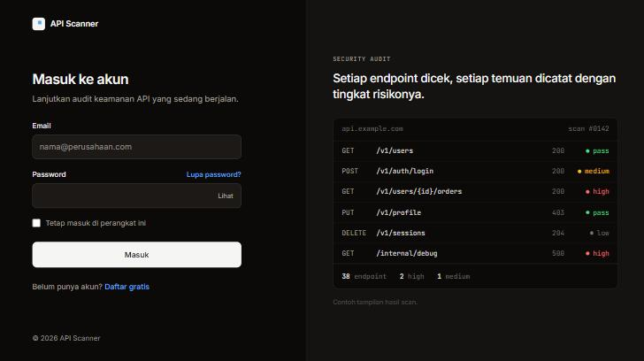
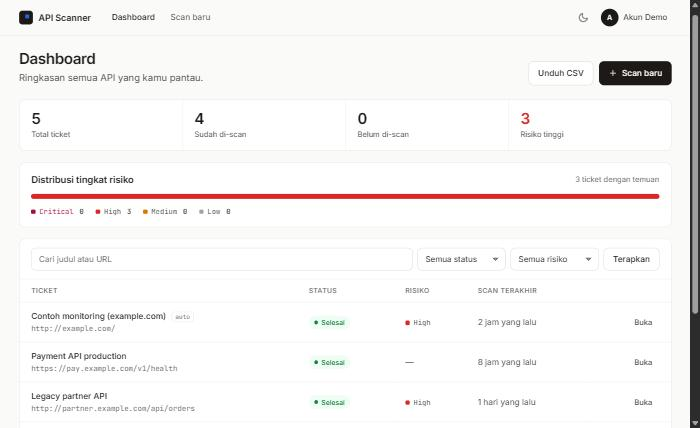
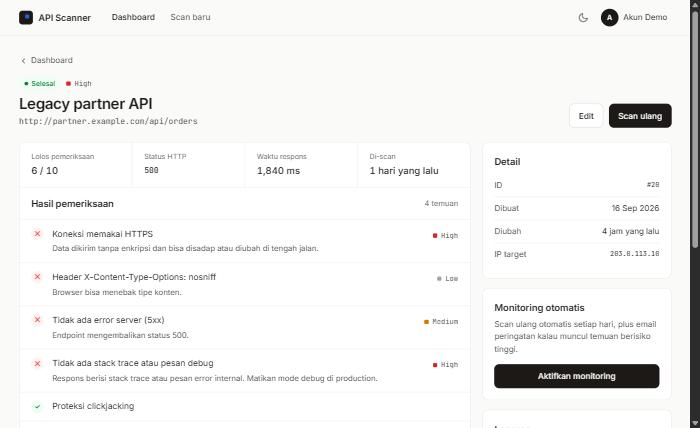

<div align="center">

# API Scanner

### Temukan celah di API kamu sebelum orang lain menemukannya.

Tempel URL endpoint, jalankan scan, dan dapatkan daftar masalah konfigurasi yang diurutkan dari yang paling berisiko — lengkap dengan cara memperbaikinya.

[](https://github.com/ZainulArkaanAlinsi/api-security-scanner/actions/workflows/tests.yml)
[](LICENSE)




</div>

---

## Masalahnya

Kebanyakan kebocoran API bukan karena serangan canggih. Penyebabnya hal-hal kecil yang terlewat saat deploy: header keamanan yang lupa dipasang, CORS yang dibuka untuk semua origin saat debugging lalu lupa ditutup, mode debug yang masih menyala di production, atau sertifikat yang habis diam-diam di hari Sabtu.

Semua itu bisa dicek dalam hitungan detik — asal ada yang rutin mengeceknya.

## Solusinya

Daftarkan endpoint sekali, lalu biarkan aplikasi ini yang mengecek. Setiap temuan datang dengan penjelasan **kenapa itu berbahaya** dan **apa yang harus diubah**, bukan sekadar label merah.

<table>
<tr>
<td width="50%" valign="top">

**Hasil scan yang bisa ditindaklanjuti**

Setiap pemeriksaan menunjukkan lolos atau gagal, tingkat risikonya, dan langkah perbaikan yang konkret.



</td>
<td width="50%" valign="top">

**Masuk tanpa basa-basi**

Halaman login dengan contoh hasil scan di sisinya, supaya pengunjung langsung tahu ini aplikasi apa.



</td>
</tr>
</table>

### Mode terang & gelap

Tema mengikuti setelan sistem, dan bisa diganti kapan saja lewat satu tombol di navbar.

<table>
<tr>
<td width="50%" valign="top" align="center">

**Terang**




</td>
<td width="50%" valign="top" align="center">

**Gelap**


</td>
</tr>
</table>

---

## Apa yang dicek

Sampai **12 pemeriksaan** di setiap scan:

| Pemeriksaan | Risiko | Kenapa penting |
|---|:---:|---|
| Koneksi HTTPS | 🔴 high | Tanpa TLS, data bisa disadap dan diubah di tengah jalan |
| Stack trace & pesan debug | 🔴 high | Respons error membocorkan struktur internal aplikasi |
| CORS wildcard + credentials | 🔴 high | Situs mana pun bisa memakai sesi pengguna kamu |
| Masa berlaku sertifikat TLS | 🟠 medium | Peringatan sebelum sertifikat habis dan API mati total |
| Header HSTS | 🟠 medium | Mencegah browser diturunkan kembali ke http |
| Flag cookie HttpOnly & Secure | 🟠 medium | Cookie tanpa flag bisa dibaca JavaScript |
| Error server 5xx | 🟠 medium | Endpoint yang crash sering menandakan input tak tervalidasi |
| X-Content-Type-Options | ⚪ low | Mencegah browser menebak tipe konten |
| Proteksi clickjacking | ⚪ low | Halaman tidak bisa disematkan di iframe orang lain |
| Content-Security-Policy | ⚪ low | Membatasi sumber script dan konten |
| Kebocoran versi software | ⚪ low | Versi di header memudahkan pencarian exploit |
| Waktu respons | ⚪ low | Endpoint lambat lebih mudah dijatuhkan |

## Cara kerjanya

```
  1. Tambahkan endpoint        2. Scan masuk antrean         3. Perbaiki & scan ulang
  ─────────────────────        ──────────────────────        ───────────────────────
  Tempel URL API publik        Worker mengerjakan di          Ikuti saran tiap temuan,
  yang ingin diperiksa    ──▶  latar belakang, halaman   ──▶  lalu bandingkan dengan
                               memperbarui sendiri            scan sebelumnya
```

Setiap scan disimpan, jadi halaman ticket bisa menunjukkan **apa yang sudah kamu perbaiki** dan **apa yang baru muncul** sejak scan terakhir — beserta grafik trennya.

---

## Fitur

| | |
|---|---|
| 🔎 **Scanner** | 12 pemeriksaan keamanan, hasil diurutkan dari risiko tertinggi |
| ⚡ **Antrean** | Scan dikerjakan worker di latar belakang, request web tidak pernah menunggu |
| 📈 **Riwayat & perbandingan** | Grafik tren, daftar temuan yang diperbaiki dan yang baru, riwayat ber-pagination |
| 🔔 **Monitoring otomatis** | Scan ulang tiap 6 jam, email peringatan hanya untuk temuan high/critical yang benar-benar baru |
| 📄 **Laporan** | Versi cetak / simpan PDF, unduhan JSON, dan export CSV daftar ticket |
| 🔐 **Akun** | Register, login berbatas percobaan, reset password, profil, hapus akun |
| 🛡️ **Aman by default** | Anti-SSRF, isolasi data antar pengguna, rate limit, dan header keamanan di aplikasinya sendiri |
| 🌗 **UI** | Mode terang/gelap, responsif, aksesibel (WCAG AA), halaman error kustom |

### Aman sejak di dalam

Aplikasi yang menilai keamanan orang lain harus tahan uji sendiri:

- **Anti-SSRF berlapis** — localhost, IP privat, dan alamat metadata cloud ditolak; koneksi dikunci ke IP yang sudah divalidasi supaya DNS tidak bisa ditukar di tengah jalan; redirect tidak diikuti
- **Tidak bisa disalahgunakan** — scan dibatasi ke port 80/443 dan respons dipotong di 5 MB
- **Data terisolasi** — ticket milik pengguna lain dijawab 404, bukan 403, supaya ID tidak bisa ditebak
- **Tahan gagal** — scan yang mati di tengah jalan tidak meninggalkan ticket menggantung, dan satu ticket tidak bisa di-scan dua kali bersamaan
- **Header sendiri lulus** — `X-Frame-Options`, CSP, `nosniff`, `Referrer-Policy`, dan HSTS dipasang otomatis

---

## Mulai dalam 5 menit

```bash
git clone https://github.com/ZainulArkaanAlinsi/api-security-scanner.git
cd api-security-scanner

composer install
npm install && npm run build

cp .env.example .env
php artisan key:generate
php artisan migrate
php artisan db:seed --class=DemoSeeder   # opsional: data contoh
```

Jalankan **dua proses** ini:

```bash
php artisan serve        # aplikasi web
php artisan queue:work   # pengeksekusi scan  <- wajib, tanpa ini scan tidak pernah selesai
```

Buka http://127.0.0.1:8000, lalu masuk dengan akun demo:

| Email | Password |
|---|---|
| `demo@example.com` | `demo12345` |

> Akun demo berisi 4 ticket contoh: API yang membaik dari waktu ke waktu, endpoint legacy bermasalah, sertifikat yang hampir kedaluwarsa, dan ticket yang belum pernah di-scan. Jangan jalankan seeder ini di production.

### Monitoring otomatis

Aktifkan lewat tombol di halaman ticket, lalu jalankan penjadwal:

```bash
php artisan schedule:work                # lokal
# di server: * * * * * cd /path && php artisan schedule:run >> /dev/null 2>&1
```

`scan:due --hours=2` berjalan tiap 6 jam. Bisa juga manual:

```bash
php artisan scan:due --hours=6 --limit=5
```

Email hanya dikirim untuk temuan **high/critical yang belum ada di scan sebelumnya**, jadi tidak ada spam untuk masalah yang sama.

---

## Konfigurasi

| Variabel `.env` | Default | Keterangan |
|---|---|---|
| `SCANNER_CA_BUNDLE` | kosong | Path file CA untuk verifikasi HTTPS. **Wajib di Laragon/Windows** jika `curl.cainfo` kosong, misalnya `C:/laragon/etc/ssl/cacert.pem` |
| `SCANNER_ALLOW_PRIVATE` | `false` | Izinkan scan ke IP privat. Aktifkan hanya di mesin lokal |
| `SCANNER_TIMEOUT` | `10` | Batas waktu respons target (detik) |
| `QUEUE_CONNECTION` | `database` | Scan dijalankan lewat antrean |
| `MAIL_MAILER` | `log` | Dengan `log`, email ditulis ke `storage/logs/laravel.log` |

<details>
<summary><b>Checklist sebelum deploy ke production</b></summary>

<br>

- [ ] `APP_ENV=production` dan `APP_DEBUG=false` — mode debug membocorkan stack trace dan isi env
- [ ] `APP_KEY` dibuat ulang dengan `php artisan key:generate`
- [ ] `APP_URL` diisi domain sebenarnya (dipakai link email)
- [ ] `SESSION_SECURE_COOKIE=true` saat memakai HTTPS
- [ ] `SCANNER_ALLOW_PRIVATE=false`
- [ ] Konfigurasi SMTP diisi, jangan biarkan `MAIL_MAILER=log`
- [ ] Queue worker dijalankan sebagai service (Supervisor/systemd)
- [ ] `DemoSeeder` tidak dijalankan

</details>

---

## Deploy

Sudah tersedia `Dockerfile`, `fly.toml`, dan `docker-compose.yml`. Satu image dipakai tiga proses: web, queue worker, dan scheduler.

```bash
docker compose up --build     # jalankan versi production di komputer sendiri
fly deploy                    # atau ke Fly.io
```

Panduan lengkap untuk **Railway** dan **Fly.io**, termasuk daftar variabel dan checklist setelah deploy: **[docs/DEPLOY.md](docs/DEPLOY.md)**.

> Platform yang hanya menjalankan satu proses web (Vercel, Netlify, shared hosting) tidak cocok, karena scan dikerjakan oleh worker terpisah.

## Teknologi

**Laravel 12** · **PHP 8.2+** · MySQL/MariaDB atau SQLite · antrean berbasis database · Blade dengan design system sendiri (tanpa framework CSS) · PHPUnit · GitHub Actions

### Peta kode

| Lokasi | Isi |
|---|---|
| `app/Services/ApiScanner.php` | Semua logika pemeriksaan dan pertahanan SSRF |
| `app/Services/ScanRunner.php` | Menjalankan scan, menyimpan riwayat, memicu notifikasi |
| `app/Jobs/ScanTicketJob.php` | Scan versi antrean, lengkap dengan penanganan worker mati |
| `app/Services/CertificateInspector.php` | Membaca masa berlaku sertifikat TLS |
| `app/Policies/TicketPolicy.php` | Aturan kepemilikan ticket |
| `app/Http/Middleware/SecurityHeaders.php` | Header keamanan aplikasi sendiri |
| `resources/views/partials/theme.blade.php` | Design token dan komponen UI bersama |

## Testing

```bash
php artisan test        # 49 test
./vendor/bin/pint       # code style
```

Test memakai SQLite in-memory, jadi database utama tidak tersentuh. Request HTTP dan pemeriksaan sertifikat di-mock, sehingga test jalan tanpa koneksi internet. Setiap push diperiksa GitHub Actions.

## Rencana berikutnya

- [ ] Verifikasi email saat registrasi
- [ ] API token supaya scan bisa dipanggil dari pipeline CI
- [ ] Webhook ke Slack/Discord selain email
- [ ] Perbandingan antar dua scan pilihan

---

## Catatan penggunaan

Scanner hanya mengirim satu request `GET` ke URL yang kamu daftarkan — tidak ada eksploitasi, tidak ada brute force. Meski begitu, **scan hanya endpoint yang kamu miliki atau yang kamu punya izin untuk menguji.**

## Lisensi

[MIT](LICENSE) © Zainul Arkaan Alinsi
